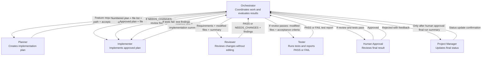

# Orchestration Diagram - Product Review Feature

Target Codebase: Art & Craft Marketplace

This workflow coordinates specialized agents for adding a Product Review feature.

## Handoff and Evaluation Rules

1. The Orchestrator sends the feature request, repository path, and acceptance criteria to the Planner.
2. The Planner returns a numbered plan, expected file list, and any open questions.
3. The Orchestrator checks that the plan is complete and within scope before implementation.
4. The Implementer receives the approved plan and returns modified files plus an implementation summary.
5. The Reviewer checks the changes without editing files.
6. If the Reviewer returns NEEDS_CHANGES, the Orchestrator sends the findings back to the Implementer.
7. If review passes, the Tester runs the approved test suite.
8. If tests fail, the Orchestrator sends the failure information back to the Implementer.
9. Human approval is required after review and tests pass.
10. The Project Manager may update final status only after human approval.

